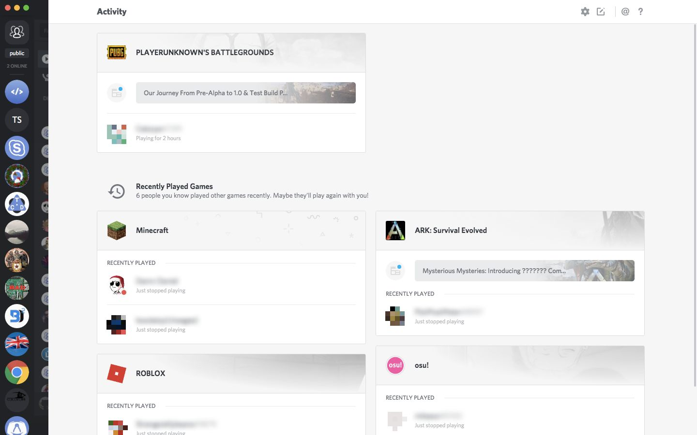
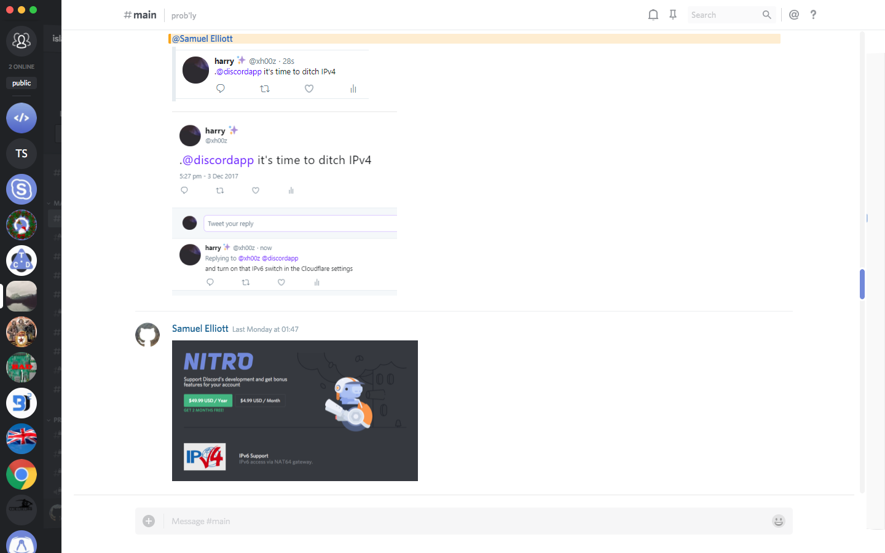

Hide Discord Sidebars
===

Hides sidebars in Discord so you have a little extra space and a cleaner view. Show them again by hovering over them.

Installation
---

Save the file `hide-sidebars.theme.css` from the [releases][] page to the BetterDiscord themes folder and restart Discord (unless you have a plugin like [Restart No More](https://github.com/Inve1951/BetterDiscordStuff/blob/master/plugins/restartNoMore.plugin.js)).

[releases]: https://github.com/samuelthomas2774/bd-hide-sidebars/releases

Screenshots
---

