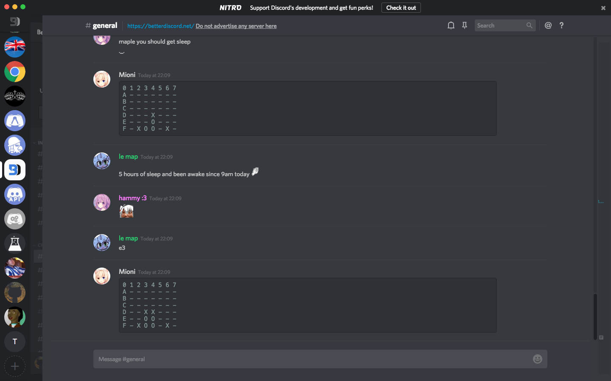
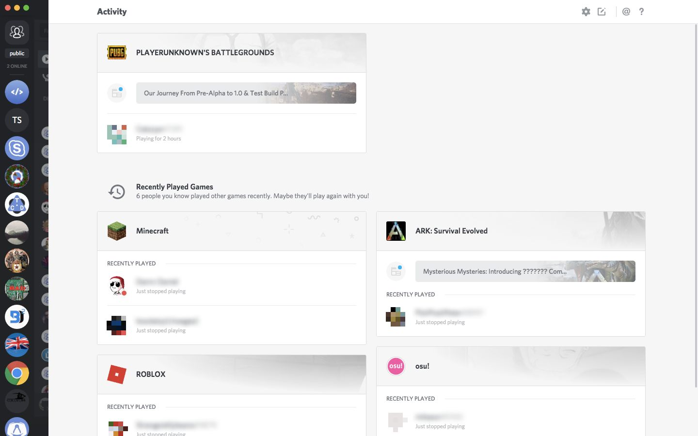
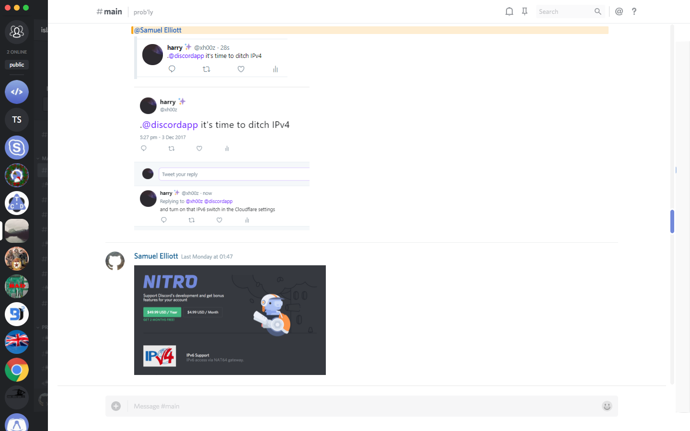

Hide Discord Sidebars
===

Hides sidebars in Discord so you have a little extra space and a cleaner view. Show them again by hovering over them.

[This doesn't work too well with transparent themes](images/screenshot-transparent.png) as the channel and member lists are still visible behind the chat contents. You can add a background image to `.chat .content > div:first-child` to hide the channel/member lists.

Installation
---

#### BetterDiscord v1

Save the file `hide-sidebars.theme.css` from the [releases][] page to the BetterDiscord themes folder and restart Discord (unless you have a plugin like [Restart No More](https://github.com/Inve1951/BetterDiscordStuff/blob/master/plugins/restartNoMore.plugin.js)).

#### BetterDiscord v2

Download the zip archive from the [releases][] page and extract it to the BetterDiscord themes folder. Then in the themes panel, click the refresh button on the Installed tab.

[releases]: https://github.com/samuelthomas2774/bd-hide-sidebars/releases

Screenshots
---

